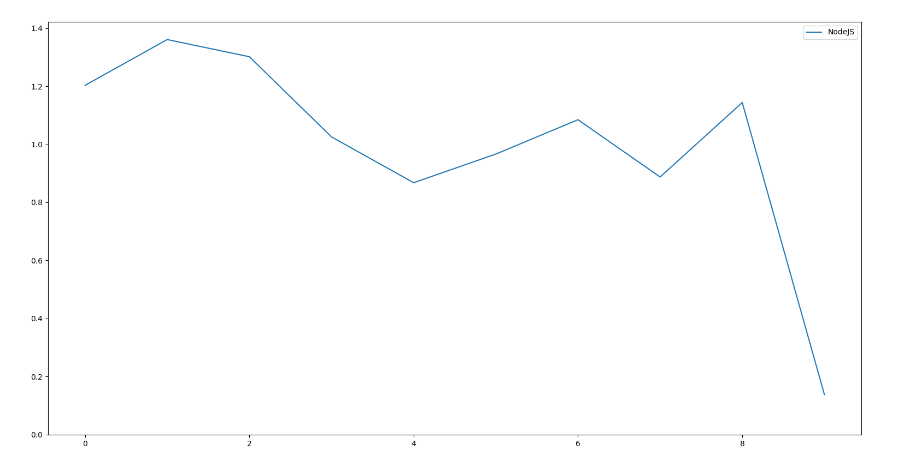

### Rapport sur les languages durant la BattleDev de Juin 2021

 

La BattleDev est la plus grande compétition de code en France, elle à lieu tout les 6 mois et réunie à chaque occassion plusieurs milliers de développeurs.
La compétition est divisé en 6 exercices qu'ils faut résoudre en moins de 2 heures. Les 2 premiers exercices sont faciles, puis les 2 suivant sont d'une difficulté moyenne et les 2 dernières sont difficile. Je dirais que les 2 premiers exercices devrait pouvoir etre résolu par une très grande majorité des compétiteurs ayant un minimum d'expérience avec la programmation. Le 3ème est déjà plus difficile mais est possible pour beaucoup de personne. L'exercice 4 est probablement celui qui fait le tri entre ceux qui sont bon et ceux qui sont moyen. Environ 10-15% des compétiteurs arrivent à le passer dans le temps impartie. L'exercice 5 est lui bien plus difficile que le 4 est permet de faire la différence entre ceux qui sont très bon et ceux qui sont bon. Seul 2% y arrivent. L'exercice 6 quand à lui permet de faire la différence entre les quelques personnes qui ont un niveau exceptionelle et les autres. Il n'y en à eu que 2 qui ont réussi cette exercice pour l'édition Juin 2021.

Je vais essayer de faire une analyse des languages (de programmation) utilisés durant la BattleDev 2021.

## L'utilisation des languages

 

Python est de loin le language le plus utilisé pour cette compétition. Il est 2 fois plus utilisé que sont compétiteur le plus proche, Javascript. 

On peut diviser les languages en 3 catégories. 

Python, dans sa propre catégorie, très populaire, autant chez les débutant, de par sa simplicité que chez les "pro", de par sa rapidité d'écriture et une syntax qui permet de répondre rapidement à des problèmes alors qu'il faut plusieurs lignes de code pour faire la même chose dans d'autre language. Python à aussi l'avantage d'etre le language utilisé au lycée maintenant et également le language utilisé par les correcteur de la compétition.

Le deuxième groupe est celui des language populaire (JS, PHP, Java, C++ et C#). Ce sont les languages mainstream utilisé en programmation donc il n'est pas suprennant de ces language beaucoup utilisé.
Je pense que C++ à une "sur representation" dans ce concours par rapport à sont utilisation réel. Ceci étant du à l'avantage qu'il procure durant la compétition. D'ailleurs dans le top 10 il est le language le plus utilisés (7 personnes sur 10).

Le troisième groupe est celui des languages peu utilisé (Kotlin, Ruby, Swift, Go, Scala). Par example Scala n'a était choisi que par 11 utisateurs. Ce sont surtout des languages spécialisés donc c'est normal qu'ils soit peu representés.

Le C est un peu entre le deuxième et le troisième groupe. Mais plus proche du second groupe. Je dirait que le C est un language peu adapté à une compétition avec une limite de temps. Il faut avoir une bonne connaissance du language et etre rodé pour pouvoir l'utilisé de manière decente. Il faut écrire pas mal de code squelette pour pouvoir faire même des opérations relativement simple. La raison qu'il est quand même plutôt bien representé est le fait qu'il soit utilisé comme language d'introduction à la programmation (à raison) dans de nombreux écoles. Donc je pense que les débutants qui apprennent le C sont tenté de l'utilisé pendant un concours.

 

Le top 25. On peut voir une domination du C++, suivi par Python. Plus on monte dans le classement plus la domination du C++ se fait ressentir.

### La performance des languages

## Exercice moyen réussi par language

Le premier indicateur de performance d'un language que je vais analyser est l'exercice moyen qu'un utilisateur d'un language donnée à réussi.

Comme on peut le voir sur le graphique que le C est le language qui à le moins bien réussi. En moyenne un utilisateur de C n'a pas réussi à résoudre les 2 premiers exercices alors que tout les autres languages ont réussi cela. Cela confirme que le C est un language peut adapter à la compétition et qu'il est surtout utilisé par les débutants. Le language qui à le mieux réussi est le C++, suivi de près par le Python. Les autres languages ont des taux relativement similaire, le C# étant un peu mieux que les 3 autres.

## Rang moyen attend par language

Le second indicateur est le rang moyen attend par un utilisateur d'un language donnée. Plus le rang est faible plus le language est performant.

Clairement et encore une fois le C est le dernier language, parmis les languages populaires et même parmis tout les languages (non montré sur le graph). Il est très largement en dessous du reste. Un utilisateur moyen du C est classé 2217 ème soit quasiment 1000 place derrière un utilisateur de Python. D'ailleurs le Python est cette fois (légèrement) mieux classé que le C++. Cela peut s'expliquer par le fait que les utilisateur de C++ ont peut etre mieux réussi à finir les exos mais était en moyenne un peu moins bien classer (plus de temps à finir un exo), mais je pense qu'il faut pas essayer d'extrapoler des explications sur des différences mineur.
Les autres languages sont encore une fois assez proche les unes des autres. Le C# étant une nouvelle fois un peu mieux que les 3 autres.

Sur ce graphique ont vois le classement qui inclus les languages peu choisi. Ont vois que Kotlin, Scala et Ruby ont tout les 3 mieux réussi que le Python. Mais je pense que cette relative réussite est surtout du au fait qu'étant des languages spécialisé et peu populaire ils sont surtout utilisé par des personnes connaissent assez bien leur languages.

## L'utilisation des languages par rapport à la position dans le classement

Le troisème indicateur est le pourcentage de l'utilisation d'un language suivant les tranches. Par example parmis les personnes classés dans le top 10% combien ont utilisé le Python. Les tranches sont divisés tranches de 10%. Les graphiques sont centrés sur 1.

Je commence par le Java car il montre un profil assez particulier mais qui reste très claire et qui permet d'expliquer la philosophie des graphs préssenté par la suite.
Le Java est fortement utilisé par les débutants. En effet on voit qu'il commence à plus de 1.8 au début du graph. Ce qui signifie que parmis les 10% les moins bien classé le Java est utilisé 1.8 fois plus qu'ailleurs. Ensuite il baisse rapidement avec un creux parmis les joueurs moyen (0.5). Il est un peu plus utilisé par les joueurs bien classé mais reste tout de même sous utilisé (0.8).
Java est donc plutôt un language orienté débutant mais avec quelques utilisateur aguérri.

Le PHP affiche un profil plutôt inverse du Java (sauf dans le très haut niveau). Il est très utilisé par les utilisateurs moyen mais est totalement délaissé par les utilisateurs bien classé.
C'est un language orienté personne d'un niveau moyen et très peu utilisé par les personnes bien classé.

Le profil du C confirme ceux que j'ai dit plus haut. Il est extrèmement populaire parmis les débutants mais peu populaire dans le reste des catégories. Ils est quasiment pas utilisés par les utilisateurs moyen. Il y a quelques personnes bien classés qui l'ont utilisés.
Globalement un language orienté débutant mais utilisé par quelques personnes avec un très bon niveau.

Le profil du C++ montre que pas mal de débutant tente de l'utilisé mais ont beaucoup de mal. Il est relativement peu utilisé par les joueurs moyens. Par contre il est extrèmement utilisé parmis les top players. Ont dirait qu'il y a deux catégorie de personnes soit les personnes qui utilisent le CPP pour avoir un avantage mais qui ne connaissent pas le language. Et cela constitue un handicap pour eux. Soit les personnes maitrissent vraiment le CPP est réussissent très bien le concours.

Le JS presente une profil très particulier. Il est très utilisé par toutes les catégories sauf parmis les TOP performeurs ou il s'écroule complétement.

Enfin le fameux Python. Contrairement à ceux que je penser il est très peu utilisé parmis les débutants et est très utilisé parmis les TOP performeurs. Ont vois clairement que plus ont monte dans les catégories plus le language est utilisé.

Pour information je n'ai pas mis le profil du C#, car c'était pas très intéressant. Globalement c'était une ligne droite et donc il avait une utilisation assez similaire quelque soit le niveau.

Ce graphique est montre la consolidation des données. Ont peut voir que le Python domine toute les catégorie, et de plus en plus lorsque l'on monte en catégorie. Il est quasiment utilisé par 70% des personnes parmis les tops performeurs. La seul catégorie ou le Python n'est pas premier est dans la catégorie des 10% les plus faible ou Java est le language le plus utilisé.
La chute du JS parmis les top performeurs est encore plus impressionnant dans ce graphique. Il passe de la deuxième place à l'avant dernière place, juste devant le C.
Ont peut également voir le C# faire sont chemin tranquille sans trop varier.

### Conclusion

Globalement le Python domine, et en nombre d'utilisateur et parmis les meilleurs, même si sur le haut du podium le C++ ne laisse pas sa place échappé (les 2 premières places ont été obtenue par des utilisateurs de C++).
C'est assez intéressant de voir l'utilisation des languages et leur profil. Ont peut presque dire qu'un language donne un indice sur l'utilisateur potentielle de celui-ci.